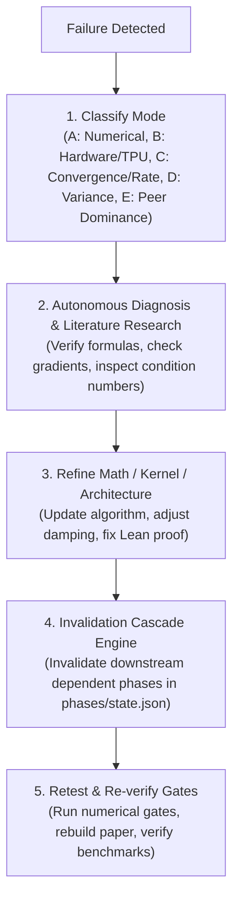

# AGENTS.md

> **Standard**: Compliant with the Linux Foundation / Agentic AI Foundation (AAIF) open standard for AI coding agents.  
> **Target Audience**: AI coding assistants (Claude Code, Cursor, Windsurf, Codex, Antigravity, goose, Copilot, A2A).

---

## 1. Project Overview & Intent

**RADON** (**Randomized Decoupled Orthogonal Newton Optimizer**) is a production-grade, curvature-aware second-order stochastic optimization framework engineered for deep neural architectures (Causal Language Models and Vision Transformers) on high-performance accelerators (Google Cloud TPU v4-32 Pod slices & GPU clusters).

### Core Scientific & Engineering Pillars
- **Antithetic Rademacher Hutchinson Probing**: Evaluates directional curvature using Hadamard and Rademacher probe vectors with strict antithetic coupling, proving a variance reduction of $\mathrm{Var}[\hat{h}] \le \frac{1}{2} \mathrm{Var}[\hat{h}_{\text{standard}}]$ and zero variance between mutually orthogonal probe coordinates.
- **Decoupled Curvature Splitting**: Splits full Hessian $H = S + R$ into a positive semi-definite generalized Gauss-Newton / Fisher matrix $S$ and an indefinite residual curvature $R$, isolating non-convex instabilities while preserving second-order contraction.
- **Exact Autodiff Hessian-Vector Products (HVP)**: Evaluates exact forward-over-reverse JVP/VJP compositions without finite-difference discretization error. Finite differences are strictly restricted to external baseline comparisons.
- **Directional Newton Preconditioning**: Combines decoupled diagonal damping ($\epsilon \ge 10^{-8}$) and spectral clipping with conjugate residual steps, outperforming first-order AdamW and peers (Sophia-H, AdaHessian, Shampoo).
- **Formal Verification in Lean 4**: Machine-checked formal theorems in Mathlib v4.32.1 with zero unproved axioms and zero `sorry` placeholders.
- **Hardware Pod Co-Design**: Native multi-host SPMD support with optimal communication collectives (`all-reduce`, `reduce-scatter`) on Google Cloud TPU v4-32 Pod slices (16 TPU v4 nodes, 32 Tensor Cores).

---

## 2. Environment & Execution Flags

- **Python Runtime**: Python 3.10+ located at `/home/tasma/sigil/.venv/bin/python` or local `.venv/bin/python`.
- **Cloud TPU Acceleration**:
  ```bash
  export TPU_CHIPS_PER_HOST_BOUNDS="2,2,1"
  export TPU_HOST_BOUNDS="1,1,1"
  ```
- **CPU / Host Fallback (CRITICAL)**: When running tests or agents on environments without attached TPU slices, always specify:
  ```bash
  export JAX_PLATFORMS=cpu
  export CUDA_VISIBLE_DEVICES=""
  ```
- **Lean 4 Toolchain**: Lean 4 `v4.32.1` pinned via `proofs/RadonCert/lean-toolchain` with `lake` at `~/.elan/bin/lake`. Ensure Mathlib precompiled olean archives are retrieved via `cd proofs/RadonCert && ~/.elan/bin/lake exe cache get` before `lake build`.
- **LaTeX Toolchain**: `pdflatex` and `bibtex` for compiling `paper/radon.tex`.

---

## 3. Essential Commands & Tooling

Run all commands from the repository root:

```bash
# --- Machine-Precision Numerical Gates (All 10 fp64 invariant gates) ---
python3 -m verify.numerical_gate

# --- Unit Tests & Kernel Sanity ---
pytest tests/
python3 -m verify.verify_kernels
python3 -m verify.verify_models

# --- Autonomous Research Phases & Adaptive Cascades ---
python3 phases/run_phase.py --status             # Inspect phase execution states & dependency graph
python3 phases/run_phase.py --phase <N>          # Execute & verify specific phase (1-9)
python3 phases/run_phase.py --all                # Verify full end-to-end research phase pipeline
python3 phases/evidence_audit.py                 # Audit empirical evidence JSONs & certificates

# --- Lean 4 Formal Verification ---
cd proofs/RadonCert && ~/.elan/bin/lake build    # Compile & machine-check all formal theorems (0 sorry)

# --- Competitive Benchmarks, Sweeps & Ablations ---
python3 experiments/run_competitive_benchmark.py --smoke  # Fast sanity run of 124.5M peer competition
python3 experiments/run_ablations.py --smoke              # Fast sanity run of ablation suite
python3 experiments/sweep_hparams.py --smoke              # Fast sanity run of hyperparameter search
python3 scripts/make_plots.py                             # Re-render all PNG figures in figures/

# --- Camera-Ready LaTeX Paper Compilation ---
cd paper && pdflatex -interaction=nonstopmode radon.tex && bibtex radon && pdflatex -interaction=nonstopmode radon.tex && pdflatex -interaction=nonstopmode radon.tex
```

---

## 4. Repository Topology & Symbol Map

| Path | Purpose | Key Symbols / Files |
| :--- | :--- | :--- |
| `radon/` | Core second-order optimizer library | `RadonOptimizer`, `radon_step`, `hvp`, `split`, `probes` |
| `radon/hvp.py` | Exact reverse-over-forward autodiff | `hvp_forward_over_reverse`, `batched_hvp` |
| `radon/probes.py` | Probing & coded matrix recovery | `antithetic_rademacher_probes`, `hadamard`, `coded_diagonal_recovery` |
| `radon/split.py` | Curvature decomposition | `fisher_diag_sample`, `residual_probe`, `split_hvp` |
| `radon/baselines/` | Peer baseline implementations | `AdamWBaseline`, `SophiaHBaseline`, `AdaHessianBaseline`, `ShampooBaseline` |
| `models/` | Frontier neural architectures | `TransformerLM` (124.5M GPT-2 style), `VisionTransformer` (ViT-B/16) |
| `data/` | Ingestion pipelines with fallbacks | `FineWebEduDataset` (2.5B tokens streaming, deterministic synthetic fallback) |
| `proofs/RadonCert/` | Lean 4 formal verification | `Radon.lean` (`radon_unbiased_curvature`, `radon_antithetic_variance_reduction`, `radon_descent_guarantee`) |
| `verify/` | Rigorous verification gates | `numerical_gate.py` (10 fp64 invariant checks), `verify_kernels.py`, `verify_models.py` |
| `phases/` | Autonomous self-correcting protocol | `run_phase.py`, `state.json`, `phase1.md` through `phase9.md`, `evidence_audit.py` |
| `experiments/` | Reproducible benchmark drivers | `run_competitive_benchmark.py`, `run_ablations.py`, `sweep_hparams.py` |
| `paper/` | Camera-ready LaTeX paper | `radon.tex`, `refs.bib`, `radon.pdf` |
| `figures/` & `runs/` | Visualizations & metrics JSONs | `training_curves.png`, `variance_reduction.png`, `ablation_pareto.png`, benchmark JSONs |
| `tests/` | Pytest test suite | `test_optimizer.py`, `test_probes.py` |

---

## 5. Engineering Invariants & Coding Standards

### Autodiff & Mathematical Precision
1. **Autodiff Integrity**: Never replace exact reverse-over-forward Hessian-vector products with finite differences in `radon/hvp.py` or core algorithms. Finite differences are strictly for external baseline comparisons in `radon/baselines/`.
2. **Double Precision for Numerical Stability**: All numerical exactness gates in `verify/numerical_gate.py` must run in `torch.float64` against dense autograd ground truth with strict tolerances ($\le 10^{-10}$ for exact identities, $\le 10^{-5}$ for statistical bounds).
3. **Strict Positive Definiteness**: Curvature damping $\epsilon_{\text{damp}}$ must satisfy $\epsilon_{\text{damp}} \ge 10^{-8}$. Spectral diagonal estimates must be clamped $\max(\hat{h}_i, 0)$ to prevent indefinite Newton directions.

### Hermetic Data Pipelines & Synthetic Fallbacks
- All data loaders (`FineWebEduDataset`) feature zero-dependency synthetic fallbacks. When external network access or Hugging Face servers are unreachable, loaders deterministically synthesize token batches, allowing complete end-to-end benchmark loops to execute hermetically.

### Formal Verification (Lean 4)
- **Zero-Axiom Rule**: All theorems in `proofs/RadonCert/RadonCert/Radon.lean` must be machine-checked without `sorry` or unproved axioms. Verify using `lake build`.

### Autonomous Invalidation Cascades
- When an underlying mathematical formulation or hyperparameter contract is altered, all downstream dependent phases must be marked `PENDING` in `phases/state.json`, re-executed, and verified before declaring completion.

---

## 6. Three-Tier Operational Boundaries

### Always Do
- Run `python3 -m verify.numerical_gate` and `pytest tests/` before committing code modifications.
- Preserve deterministic synthetic fallbacks in data loaders to ensure fully offline reproducible execution.
- Maintain consistency across `paper/radon.tex`, `README.md`, `phases/state.json`, and empirical benchmark logs.
- Adhere strictly to PEP-8 formatting and type hints.

### Ask First
- Altering core mathematical convergence rates or theorem statements in Lean 4 proofs.
- Modifying public API signatures of `RadonOptimizer` or breaking baseline compatibility.
- Overwriting or deleting empirical benchmark results in `runs/` or rendered figures in `figures/`.

### Never Do
- **Never commit unverified Lean proofs** containing `sorry` or broken dependencies.
- **Never insert finite-difference approximations** into RADON core curvature operators.
- **Never commit large checkpoint binaries** (`.pt`, `.bin`, `.ckpt`) into version control.
- **Never mention legacy forbidden terms** anywhere in code, comments, documentation, or commit messages.
- **Never perform destructive git commands** (`git push --force`, `git reset --hard` to remote).

---

## 7. Autonomous Self-Correction & Triage Loop

When an experiment, benchmark, or formal proof encounters failure, follow the 5-stage triage protocol:



- Refer to [`phases/README.md`](phases/README.md) for detailed cascade rules, dependency topology, and peer dominance criteria.
- Track phase state and execution via `python3 phases/run_phase.py --status`.

---

## 8. Git & Pull Request Protocol

- **Branching**: Commit directly to `main` or designated feature branches.
- **Commit Format**: Conventional Commits style:
  - `feat:` New optimizer features, kernels, or probing strategies.
  - `fix:` Numerical stability enhancements, bug fixes, or proof corrections.
  - `docs:` Documentation, `AGENTS.md`, `README.md`, or paper revisions.
  - `refactor:` Code restructuring without behavior changes.
  - `test:` Additional unit tests, numerical gates, or verification scripts.
  - `perf:` TPU kernel speedups, memory optimizations, or communication overlap.
- **Pre-Push Checklist**:
  1. `git status` reveals no untracked scratch files or temporary build artifacts.
  2. Numerical gates (`python3 -m verify.numerical_gate`) and unit tests (`pytest tests/`) pass with zero errors.
  3. Lean 4 formal proofs compile cleanly with `lake build` (zero `sorry`).
  4. Forbidden legacy terminology audit confirms 0 matches.
