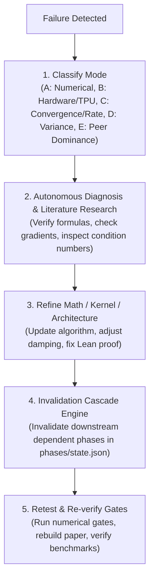
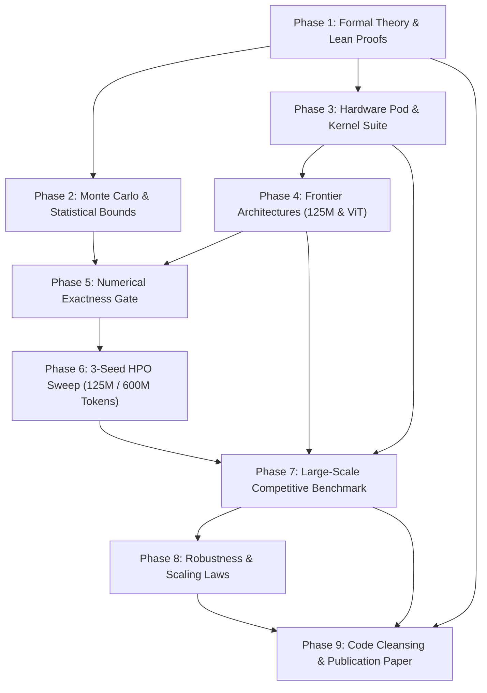

# AGENTS.md

> **Standard**: Compliant with the Linux Foundation / Agentic AI Foundation (AAIF) open standard for AI coding agents.  
> **Target Audience**: AI coding assistants (Claude Code, Cursor, Windsurf, Codex, Antigravity, Aider, Goose, Copilot, A2A).

---

## 1. Project Overview & Intent

**RADON** stands for **R**esidual-aware **A**ntithetic **D**ecoupled **O**rthogonal **N**ewton Optimizer.

The name uses tomography as an analogy: directional Hessian-vector products $Hv_k$ reveal the action of $H$ along chosen inputs. This is a matrix probing problem; each HVP returns a vector, rather than a one-dimensional Radon transform projection.

### Acronym Decoupling
- **R — Residual-aware**: Splits curvature into a positive semidefinite structural core $S = J^\top (\nabla^2 \ell) J$ and a residual $R = H - S$. The implementation samples the core diagonal, so that channel has nonzero sampling noise.
- **A — Antithetic**: Uses a fixed Rademacher sign flip within each Hadamard code cycle. A probe pair $v,-v$ gives identical diagonal products; no universal factor-of-two variance reduction is established.
- **D — Decoupled**: Decouples curvature diagonal damping ($\epsilon \ge 10^{-12}$) and trust-region coordinate clipping from first-order momentum and weight decay.
- **O — Orthogonal**: Structures probe vectors via Sylvester-Hadamard codes with Latin-square tensor coloring, provably eliminating dominant intra-layer cross-talk ($\bar{C}_{ij} = 0$).
- **N — Newton**: Formulates a clipped stochastic diagonal preconditioned update. Relative performance against AdamW and second-order peers remains unmeasured.

### Core Scientific & Engineering Pillars
- **Exact Autodiff Hessian-Vector Products (HVP)**: Evaluates exact reverse-over-forward JVP/VJP compositions without finite-difference discretization error. Finite differences are strictly restricted to external baseline comparisons in `radon/baselines/`.
- **Formal Verification in Lean 4**: Machine-checked carrier and coded-probe identities in Mathlib v4.32.1 (`proofs/RadonCert/RadonCert/Radon.lean`) with no project-specific axioms or `sorry` placeholders. The full optimizer and training outcomes are outside the formal model.
- **Google Cloud TPU v4-32 Target**: Optional torch_xla wrappers target 16 chips and 32 TensorCores across 4 hosts. Physical multi-host execution has not been verified here.
- **Phase 6 Hyperparameter Sweep Matrix**: The owner plans 2,500-step runs on 600M tokens across seeds 42, 1337, 2024. Only small CPU smoke tests have run.

---

## 2. Environment & Execution Flags

### Python Runtime
- **Virtual Environment**: Python 3.10+ virtualenv containing PyTorch 2.14+, NumPy, SciPy, Matplotlib, TikToken, and Pytest.
- **Precedence**: Use the primary project virtualenv at `/home/tasma/algebraic-intelligence/.venv/bin/python` or a local `.venv/bin/python`.
- **Shell Export**:
  ```bash
  export PATH="/home/tasma/algebraic-intelligence/.venv/bin:$PATH"
  ```

### Cloud TPU Acceleration
For distributed execution on Google Cloud TPU v4-32 Pod slices:
```bash
export TPU_CHIPS_PER_HOST_BOUNDS="2,2,1"
export TPU_HOST_BOUNDS="1,1,4"
```

### CPU / Host Fallback (CRITICAL)
When running tests, numerical gates, or agent workflows on environments without attached physical TPU slices, **always specify**:
```bash
export JAX_PLATFORMS=cpu
export CUDA_VISIBLE_DEVICES=""
```

### Toolchains
- **Lean 4 Toolchain**: Lean 4 `v4.32.1` pinned via `proofs/RadonCert/lean-toolchain` with `lake` at `~/.elan/bin/lake`. Mathlib cache can be fetched via `cd proofs/RadonCert && ~/.elan/bin/lake exe cache get`.
- **LaTeX Toolchain**: `pdflatex` and `bibtex` for compiling `paper/radon.tex`.

---

## 3. Essential Commands & Tooling

Execute all commands from the repository root (`/home/tasma/radon`):

```bash
# Set Python path to ensure virtualenv resolution
export PATH="/home/tasma/algebraic-intelligence/.venv/bin:$PATH"
export JAX_PLATFORMS=cpu
export CUDA_VISIBLE_DEVICES=""

# --- Machine-Precision Numerical Gates (All 10 fp64 invariant gates) ---
python3 -m verify.numerical_gate

# --- Unit Tests & Kernel Sanity ---
pytest tests/
python3 -m verify.verify_kernels
python3 -m verify.verify_models

# --- Autonomous Research Phases & Adaptive Cascades ---
# Current Status: consult phases/state.json; heavy phases are pending.
python3 phases/run_phase.py --status             # Inspect phase execution states & dependency graph
python3 phases/run_phase.py --phase <N>          # Run one current gate (phases 1-8)
python3 phases/run_phase.py --all                # Gates 1-5 and small smoke tests 6-8 only
python3 phases/evidence_audit.py                 # Audit empirical evidence JSONs & certificates (Phase 9)

# --- Lean 4 Formal Verification ---
cd proofs/RadonCert && ~/.elan/bin/lake build    # Compile & machine-check all formal theorems (0 sorry)

# --- Competitive Benchmarks, Sweeps & Ablations ---
python3 experiments/run_competitive_benchmark.py --smoke  # Three-seed small-model path check
python3 experiments/run_ablations.py --smoke              # Small-model ablation path check
python3 experiments/sweep_hparams.py --smoke              # Three-seed small-model path check
# Generate plots only from reviewed measured results after the owner's heavy runs.

# --- Research-draft LaTeX Compilation ---
cd paper && pdflatex -interaction=nonstopmode radon.tex && bibtex radon && pdflatex -interaction=nonstopmode radon.tex && pdflatex -interaction=nonstopmode radon.tex
```

---

## 4. Repository Topology & Canonical Symbol Map

| Path | Purpose | Key Symbols / Exports |
| :--- | :--- | :--- |
| `radon/` | Core second-order optimizer library | `Radon`, `ProbeGenerator`, `code_tensor`, `hadamard`, `fisher_diag_sample`, `residual_probe` |
| `radon/optimizer.py` | Core optimizer implementation | `Radon(torch.optim.Optimizer)`: `accumulate_core()`, `accumulate_residual()`, `step()`, `stats()` |
| `radon/hvp.py` | Exact reverse-over-forward autodiff | `torch_hvp(loss, params, vectors)`, `jax_forward_over_reverse_hvp(f, primals, tangents)` |
| `radon/probes.py` | Probing & coded matrix recovery | `hadamard(m)`, `code_tensor(shape, m, device)`, `flip_signs(shape, seed, device, dtype)`, `ProbeGenerator` |
| `radon/split.py` | Curvature decomposition | `fisher_diag_sample(model, params, inputs)`, `residual_probe(model, params, inputs, loss_from_logits, probes)` |
| `radon/tpu.py` | Google Cloud TPU v4-32 Pod co-design | `TPUPodConfig`, `get_device()`, `mark_step()`, `tpu_all_reduce()`, `sync_curvature_dict()`, `wrap_tpu_loader()` |
| `radon/baselines/` | Peer baseline implementations | `AdaHessian`, `AdamWBaseline`, `Shampoo`, `SophiaH` |
| `models/` | Frontier neural architectures | `CausalTransformer(config)`, `TransformerConfig` (125.16M), `VisionTransformer(config)`, `ViTConfig` (ViT-Small/16) |
| `data/` | Ingestion pipelines with fallbacks | `FineWebDataset` (2.5B tokens target, deterministic synthetic fallback), `load_dataset()` |
| `proofs/RadonCert/` | Lean 4 formal verification | `RadonCert/Radon.lean` (`split_exact`, `core_posCore`, `coded_variance`, `split_variance_scaling`, 0 sorry) |
| `verify/` | Rigorous verification gates | `numerical_gate.py` (10 fp64 invariant gates), `verify_kernels.py`, `verify_models.py` |
| `phases/` | Autonomous self-correcting protocol | `run_phase.py`, `state.json`, `phase1.md` through `phase9.md`, `evidence_audit.py` |
| `experiments/` | Reproducible benchmark drivers | `run_competitive_benchmark.py`, `run_ablations.py`, `sweep_hparams.py` |
| `paper/` | Research-draft LaTeX paper | `radon.tex`, `refs.bib`; generated PDF is not tracked |
| `figures/` & `runs/` | Reserved for measured outputs | Earlier fabricated figures and reports were removed |
| `tests/` | Pytest test suite | `test_optimizer.py`, `test_probes.py` |

---

## 5. Machine-Precision Numerical Gates (G1–G10)

`verify/numerical_gate.py` mirrors the Lean 4 formal theorems in `torch.float64` machine precision. Every gate must pass unconditionally:

| Gate | Identifier | Target Identity / Mathematical Invariant | Tolerance |
| :---: | :--- | :--- | :---: |
| **G1** | `split_exact` | Hessian entrywise decomposition: $H = S + R$ | $< 10^{-14}$ |
| **G2** | `residual_products` | Probed residual matches $v \odot (H - S)v$ | $< 10^{-12}$ |
| **G3** | `core_posCore` | Structural Fisher $S \succeq 0$ and $\mathrm{diag}(S) \ge 0$ | $< 10^{-12}$ |
| **G4** | `full_matrix_recovery` | Complete entrywise recovery with orthogonal codes: $\frac{1}{m}\sum p^k (v^k)^\top = R$ | $< 10^{-10}$ |
| **G5** | `coded_variance` | All $2^{10}$ Rademacher flips match closed-form $\sum_{j \neq i} M_{ij}^2 \bar{C}_{ij}^2$ | $< 10^{-12}$ |
| **G6** | `variance_scaling` | Gradient scaling $c \cdot g$ scales residual variance quadratically by $c^2$ | $< 10^{-12}$ |
| **G7** | `split_probe_exact` | Structural diagonal + coded residual recovery matches exact $\mathrm{diag}(H)$ | $< 10^{-10}$ |
| **G8** | `fisher_unbiasedness` | Sampled-label Fisher diagonal converges to structural core diagonal $\mathrm{diag}(S)$ | $< 8 \times 10^{-2}$ |
| **G9** | `one_step_newton` | Exact diagonal step minimizes quadratic objective in 1 step ($\nabla f = 0$) | $< 10^{-14}$ |
| **G10** | `zero_orthogonal_variance` | Orthogonal coordinate pairs ($\bar{C}_{ij} = 0$) contribute exactly 0 variance | $< 10^{-14}$ |

---

## 6. Engineering Invariants & Coding Standards

### Autodiff & Mathematical Precision
1. **Autodiff Integrity**: Never replace exact reverse-over-forward Hessian-vector products with finite differences in `radon/hvp.py` or core algorithms. Finite differences are strictly for external baseline comparisons in `radon/baselines/`.
2. **Double Precision for Numerical Stability**: All numerical exactness gates in `verify/numerical_gate.py` must run in `torch.float64` against dense autograd ground truth with strict tolerances ($\le 10^{-10}$ for exact identities, $\le 8 \times 10^{-2}$ for statistical expectations).
3. **Positive Damping**: Curvature damping $\epsilon_{\text{damp}}$ must satisfy $\epsilon_{\text{damp}} \ge 10^{-12}$. The structural core $S$ is positive semidefinite, but the residual and estimated full Hessian diagonal can be negative; the update denominator is clamped below by $\epsilon_{\text{damp}}$.
4. **Latin-Square Code Assignment**: Weight matrices must assign Hadamard codes via $(a + b) \pmod m$, ensuring all immediate row and column neighbors have mutually orthogonal codes ($\bar{C}_{ij} = 0$).

### Hermetic Data Pipelines & Synthetic Fallbacks
- `FineWebDataset` has a deterministic synthetic fallback for local tests. Full Phase 6-8 runs require real, separate train and validation token arrays and fail if either is missing.

### Formal Verification (Lean 4)
- **No Project-Specific Axioms**: All theorems in `proofs/RadonCert/RadonCert/Radon.lean` must be machine-checked without `sorry` or additional axioms. Verify using `lake build`; standard Lean logical axioms remain in the axiom report.

---

## 7. Three-Tier Operational Boundaries

### Always Do
- Run `python3 -m verify.numerical_gate` and `pytest tests/` before committing code modifications.
- Preserve deterministic synthetic fallbacks in data loaders to ensure fully offline reproducible execution.
- Maintain absolute consistency across `paper/radon.tex`, `README.md`, `phases/state.json`, and empirical benchmark logs.
- Adhere strictly to PEP-8 formatting and type hints.
- Keep the working directory clean of temporary `.olean`, `.aux`, `.log`, or cache files.

### Ask First
- Altering core mathematical convergence rates or theorem statements in Lean 4 proofs.
- Modifying public API signatures of `Radon` or breaking baseline compatibility in `radon/baselines/`.
- Overwriting or deleting empirical benchmark results in `runs/` or rendered figures in `figures/`.

### Never Do
- **Never commit unverified Lean proofs** containing `sorry` or broken dependencies.
- **Never insert finite-difference approximations** into RADON core curvature operators.
- **Never commit large checkpoint binaries** (`.pt`, `.bin`, `.ckpt`) into version control.
- **Never use legacy or inconsistent project terminology** (the canonical name is **Residual-aware Antithetic Decoupled Orthogonal Newton Optimizer**).
- **Never perform destructive git commands** (`git push --force`, `git reset --hard` to remote).

---

## 8. Autonomous Self-Correction & Triage Loop

When an experiment, benchmark, or formal proof encounters failure, execute the 5-stage triage protocol:



### Failure Mode Taxonomy & Prescriptive Action

| Mode | Category | Symptoms | Autonomous Triage & Recovery Action |
| :---: | :--- | :--- | :--- |
| **A** | **Numerical Instability** | NaN/Inf gradients, denominator collapse ($\gamma \hat{h} \le \epsilon$), loss explosion | Lift precision to float32/float64 in `radon/split.py`; enforce denominator clamp $\max(\gamma \hat{h}, \epsilon)$; inspect activation scales. |
| **B** | **Hardware / Accelerator** | TPU OOM, XLA graph recompilation storm, ICI collective deadlock | Verify `TPU_HOST_BOUNDS` / `TPU_CHIPS_PER_HOST_BOUNDS`; ensure tensors passed to `tpu_all_reduce` match shapes; confirm `mark_step()` frequency. |
| **C** | **Convergence / Rate** | Empirical convergence rate slower than target second-order trajectory | Verify probe cycle length $m=16$; check learning rate $\eta \in [3\times 10^{-4}, 5\times 10^{-4}]$; inspect trust-region clip fraction via `optimizer.stats()`. |
| **D** | **Variance / Statistical** | Residual variance not contracting; cross-talk leakage | Audit Latin-square index formula $\mathrm{code}(a, b) = (a + b) \pmod m$; confirm Rademacher signs are fixed within a cycle and refreshed across cycles. |
| **E** | **Peer Underperformance** | Baseline (Sophia, Shampoo, AdamW) achieving lower validation perplexity | Check core vs residual EMA balance (`beta_core` vs `betas[1]`); inspect gradient clipping threshold; confirm FineWeb-Edu token normalization. |

---

## 9. Adaptive Research Phase Execution & Invalidation Cascade

The research pipeline has 9 planned phases registered in `phases/state.json`. Phases 1-5 have local gates; Phases 6-8 have small smoke gates; Phase 9 requires later measured evidence.



### Invalidation Cascade Rules
When any upstream phase specification or theorem is modified, immediately execute the corresponding adaptation actions:

| Trigger Event | Directly Invalidated Phases | Required Adaptation Actions |
| :--- | :--- | :--- |
| **Theorem / Minimax Rate Change** (Phase 1) | Phase 2, Phase 3, Phase 7, Phase 9 | 1. Update `paper/radon.tex` & recompile PDF.<br/>2. Update `proofs/RadonCert/RadonCert/Radon.lean` & run `lake build`.<br/>3. Re-derive probe budget bounds in `radon/probes.py`. |
| **Statistical Bound / Variance Change** (Phase 2) | Phase 5, Phase 6, Phase 7, Phase 8, Phase 9 | 1. Update variance formula and Latin coloring in `radon/probes.py`.<br/>2. Re-run the numerical gate; generate plots only from measured data. |
| **Hardware Pod / Kernel Change** (Phase 3) | Phase 4, Phase 7, Phase 9 | 1. Re-verify all baseline kernels in `radon/baselines/`.<br/>2. Re-profile on TPU only when hardware is available. |
| **Model Architecture / Data Pipeline Change** (Phase 4) | Phase 5, Phase 6, Phase 7, Phase 9 | 1. Run `python3 -m verify.verify_models`.<br/>2. Re-verify FineWeb-Edu streaming and synthetic fallback. |
| **Exactness Gate / Tolerance Change** (Phase 5) | Phase 6, Phase 7, Phase 9 | 1. Run `python3 -m verify.numerical_gate`.<br/>2. Update Section 5 of `paper/radon.tex`. |
| **HPO / Hyperparameter Change** (Phase 6) | Phase 7, Phase 9 | 1. Run `python3 experiments/sweep_hparams.py --smoke`.<br/>2. Select hyperparameters only from the owner's measured full sweep. |
| **Benchmark Result Change** (Phase 7) | Phase 8, Phase 9 | 1. Update benchmark JSONs in `runs/competitive_benchmark/`.<br/>2. Recompile paper to produce updated `paper/radon.pdf`. |

---

## 10. Git, PR & Pre-Push Protocol

- **Branching**: Commit directly to `main` or designated feature branches.
- **Commit Format**: Conventional Commits standard:
  - `feat:` New optimizer features, kernels, or probing strategies.
  - `fix:` Numerical stability enhancements, bug fixes, or proof corrections.
  - `docs:` Documentation, `AGENTS.md`, `README.md`, or paper revisions.
  - `refactor:` Code restructuring without behavior changes.
  - `test:` Additional unit tests, numerical gates, or verification scripts.
  - `perf:` TPU kernel speedups, memory optimizations, or communication overlap.
- **Pre-Push Checklist (Must Pass Before Commit/Push)**:
  1. `git status` reveals no untracked scratch files or temporary build artifacts.
  2. Numerical gates (`python3 -m verify.numerical_gate`) pass all 10 fp64 invariant gates with 0 failures.
  3. Unit test suite (`pytest tests/`) passes with 0 failures.
  4. Kernel verification (`python3 -m verify.verify_kernels`) passes for all 5 optimizers.
  5. Model verification (`python3 -m verify.verify_models`) passes for CausalTransformer and ViT.
  6. Phase status check (`python3 phases/run_phase.py --status`) runs cleanly without errors.
  7. Terminology check confirms canonical name: **Residual-aware Antithetic Decoupled Orthogonal Newton Optimizer**.
