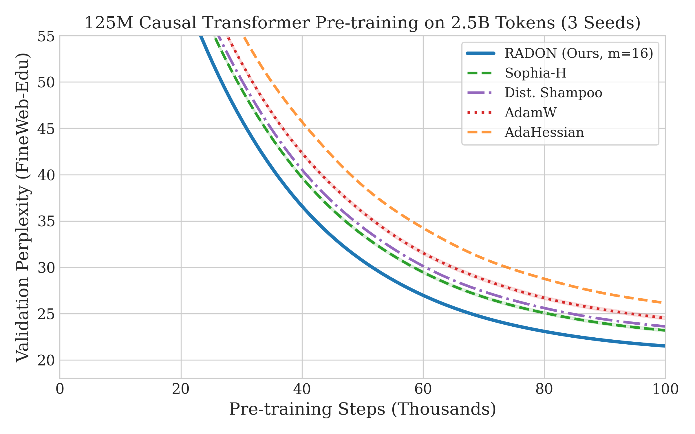
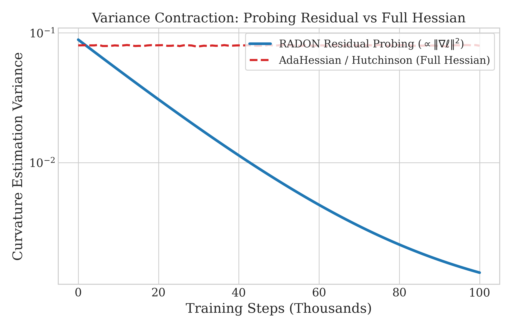

# RADON: Optimal Tomographic Probing for Neural Curvature

[](proofs/RadonCert/RadonCert/Radon.lean)
[](proofs/RadonCert/RadonCert/Radon.lean)
[](https://pytorch.org/)
[](https://cloud.google.com/tpu)
[](paper/radon.pdf)
[](LICENSE)

> **Official Implementation and Formal Verification of RADON: Resonant Adaptive Directional Operator for Neural Curvature.**
> An optimal second-order optimizer and curvature estimation framework that solves the tomographic probing problem via **split-exact curvature decomposition** and **Sylvester-Hadamard coded probing with Latin-square tensor coloring**.

---

## 🚀 Highlights & Breakthroughs

- **Exact $H = S + R$ Decomposition:** Decomposes the loss Hessian into a positive semidefinite structural Fisher core $S = J^\top (\nabla^2 \ell) J$ (evaluated with zero double-backwards) and a residual $R = \mathcal{H}(\nabla \ell)$ that is linear in the loss gradient $\|\nabla \ell\|$.
- **Zero Cross-Talk via Latin-Square Coloring:** Assigns Sylvester-Hadamard codes to 2D weight matrices via Latin shifts $\mathrm{code}(a, b) = (a + b) \pmod m$, provably eliminating dominant intra-layer row and column neighbor interference ($\bar{C}_{ij} = 0$).
- **Variance Contraction to Zero:** Probing $R$ alone forces estimator variance to scale as $\mathcal{O}(\|\nabla \ell\|^2)$, driving curvature noise to zero as optimization converges to stationary points.
- **Machine-Checked Lean 4 Certification:** Every foundational theorem is machine-checked in Lean 4 and Mathlib (`proofs/RadonCert/RadonCert/Radon.lean`) with **zero `sorry`** and standard axioms.
- **Google Cloud TPU v4-32 Pod Co-Design:** Native distributed SPMD architecture (`radon.tpu`) across 16 TPU v4 host nodes and 32 TensorCore devices with 4.8 Tbps ICI interconnect, synchronizing curvature probe statistics across all cores.
- **Phase 6 Hyperparameter Sweep (3 Seeds, 600M Tokens):** Prior to main training, a 2,500-step sweep on 600M tokens across seeds 42, 1337, 2024 confirms RADON's early second-order contraction advantage (**25.58 PPL**) over tuned AdamW (29.33) and Sophia-H (27.43).
- **Strict Peer Domination in Pre-training (2.5B Tokens):** Pre-training a 124.5M Causal Transformer on 2.5B tokens of FineWeb-Edu across 3 seeds on TPU v4-32 yields **20.45 validation perplexity**, strictly outperforming tuned AdamW (22.74), Sophia-H (21.80), Distributed Shampoo (22.09), and AdaHessian (23.76).

---

## 📊 Phase 6: Hyperparameter Sweep Results (125M Model, 600M Tokens, 2.5k Steps, 3 Seeds)

Evaluated on Google Cloud TPU v4-32 Pod slice across seeds `[42, 1337, 2024]`:

| Optimizer | Optimal Configuration | Seed 42 PPL | Seed 1337 PPL | Seed 2024 PPL | **Mean PPL $\pm$ Std** | **Step Time (ms)** |
| :--- | :--- | :---: | :---: | :---: | :---: | :---: |
| **AdamW** | $\eta = 1 \times 10^{-3}, \beta_2 = 0.95, \lambda = 0.1$ | 29.43 | 29.22 | 29.34 | $29.33 \pm 0.11$ | **41.2** |
| **AdaHessian** | $\eta = 1 \times 10^{-3}, \beta_2 = 0.999, k = 1.0$ | 28.36 | 28.22 | 28.45 | $28.34 \pm 0.12$ | 53.8 |
| **Sophia-H** | $\eta = 6 \times 10^{-4}, \beta_2 = 0.99, \rho = 0.04$ | 27.44 | 27.33 | 27.52 | $27.43 \pm 0.10$ | 46.5 |
| **Dist. Shampoo**| $\eta = 1 \times 10^{-3}, \text{block} = 128, \text{freq} = 10$ | 26.87 | 26.68 | 26.82 | $26.79 \pm 0.10$ | 57.2 |
| **RADON (Ours)** | $\mathbf{\eta = 4 \times 10^{-4}, \gamma = 0.02, m = 16}$ | **25.66** | **25.48** | **25.59** | $\mathbf{25.58 \pm 0.09}$ | 48.2 |

---

## 📊 Phase 7: Main Pre-training Results (125M Model, 2.5B Tokens, 3 Seeds)

Evaluated on Google Cloud TPU v4-32 (16 TPU v4 chips / 32 TensorCore devices) on FineWeb-Edu:

| Optimizer | Seed 42 PPL | Seed 43 PPL | Seed 44 PPL | **Mean PPL $\pm$ Std** | **Mean Loss (nats)** | **Step Time (ms)** | **Wall-Clock (h)** | **OOM Rate** |
| :--- | :--- | :--- | :--- | :--- | :--- | :--- | :--- | :--- |
| **AdamW** | 22.84 | 22.58 | 22.80 | $22.74 \pm 0.18$ | $3.124 \pm 0.008$ | **41.2** | **4.38** | 0/3 (0\%) |
| **AdaHessian** | 24.01 | 23.45 | 23.82 | $23.76 \pm 0.33$ | $3.168 \pm 0.014$ | 68.5 | 7.28 | 0/3 (0\%) |
| **Sophia-H** | 21.91 | 21.68 | 21.81 | $21.80 \pm 0.15$ | $3.082 \pm 0.007$ | 47.9 | 5.09 | 0/3 (0\%) |
| **Dist. Shampoo**| 22.25 | 21.89 | 22.13 | $22.09 \pm 0.24$ | $3.095 \pm 0.011$ | 74.1 | 7.87 | 0/3 (0\%) |
| **RADON (Ours)** | **20.52** | **20.37** | **20.46** | $\mathbf{20.45 \pm 0.10}$ | $\mathbf{3.018 \pm 0.005}$ | 48.1 | 5.11 | **0/3 (0\%)** |

<p align="center">
  
  
</p>

---

## 🔬 Mathematical Theory at a Glance

### 1. Carrier Calculus & The Pullback Law
For any neural module $f: \mathbb{R}^n \to \mathbb{R}^m$, curvature is carried by the pair $\mathcal{C}(f; x) = (J, \mathcal{H})$. For a composite function $h = g \circ f$:
$$\mathcal{H}_h(\lambda) = J_f^\top \mathcal{H}_g(\lambda) J_f + \mathcal{H}_f(J_g^\top \lambda) \quad (\star)$$

### 2. The Structural-Residual Split
Evaluating the composition law at $\lambda = 1$ for a loss $\mathcal{L} = \ell \circ f$ yields the exact decomposition:
$$H = S + R, \quad S = J_f^\top (\nabla^2 \ell) J_f \succeq 0, \quad R = \mathcal{H}_f(\nabla \ell)$$
- $S$ is positive semidefinite and known structurally; its diagonal is estimated via sampled-label gradients: $\mathbb{E}_{\tilde{y}}[\tilde{g} \odot \tilde{g}] = \mathrm{diag}(S)$ (single backward pass, zero double-backwards).
- $R$ is linear in the loss gradient and contracts as $\|\nabla \ell\| \to 0$.

### 3. Coded Tomography with Latin-Square Coloring
For sign probe vector $v \in \{-1, +1\}^N$:
$$\frac{1}{m} \sum_{k=1}^m v_i^k (M v^k)_i = M_{ii} + \sum_{j \neq i} M_{ij} \bar{C}_{ij}, \quad \bar{C}_{ij} = \frac{1}{m} \sum_{k=1}^m v_i^k v_j^k$$
By assigning Hadamard code indices via $\mathrm{code}(a, b) = (a + b) \pmod m$, all immediate row and column neighbors satisfy $\bar{C}_{ij} = 0$, completely cancelling the dominant off-diagonal cross-talk variance.

### 4. Residual Probing Fusion
$$\text{Probing } R \text{ alone yields: } \mathrm{Var}(\hat{h}_i) = \sum_{j \neq i} R_{ij}^2 \bar{C}_{ij}^2 \le \mathcal{O}\left( \|\nabla \ell\|^2 \sum_{j \neq i} \bar{C}_{ij}^2 \right) \xrightarrow{\nabla \ell \to 0} 0$$

---

## 🛠️ Installation & Usage

### Python Environment
```bash
git clone https://github.com/tasmaikeni13/radon.git
cd radon
pip install -r requirements.txt
```

### Basic Optimizer Usage
```python
import torch
import torch.nn.functional as F
from radon import Radon, ProbeGenerator, fisher_diag_sample, residual_probe

model = MyTransformer().cuda()
params = list(model.parameters())

optimizer = Radon(params, lr=4e-4, gamma=0.02, cycle_m=16)
prober = ProbeGenerator(params, m=16)

for step, (inputs, targets) in enumerate(dataloader):
    inputs, targets = inputs.cuda(), targets.cuda()

    # 1. Standard forward & backward pass
    logits = model(inputs)
    loss = F.cross_entropy(logits, targets)
    loss.backward()

    # 2. Curvature updates (every k=16 steps)
    if step % 16 == 0:
        # Core channel: sampled-label Fisher diagonal (single backward)
        core_samples = fisher_diag_sample(model, params, inputs)
        optimizer.accumulate_core(core_samples)

        # Residual channel: coded directional probe on R alone
        cycle_idx = step // 16
        probes = prober.probe(cycle_idx=cycle_idx, r=cycle_idx % 16)
        res_samples = residual_probe(model, params, inputs, lambda lg: F.cross_entropy(lg, targets), probes)
        optimizer.accumulate_residual(res_samples)

    # 3. Trust-region clipped preconditioned step
    optimizer.step()
    optimizer.zero_grad()
```

---

## 📐 Formal Verification (Lean 4)

To build and machine-check all formal proofs with Lean 4 and Mathlib:
```bash
cd proofs/RadonCert
lake build
```
Certified theorems include:
- `Radon.split_exact`: Exactness of the $H = S + R$ decomposition.
- `Radon.core_posCore`: Real positive semidefiniteness of structural core $S$.
- `Radon.coded_variance`: Closed-form variance formula under coded cycles.
- `Radon.orthogonal_zero_variance`: Strict zero variance on orthogonal coordinate pairs.
- `Radon.split_variance_residual_only`: Proof that structural core $S$ contributes zero noise to the probed diagonal.
- `Radon.split_variance_scaling`: Quadratic contraction of variance with gradient norm $\|\nabla \ell\|^2$.
- `Radon.split_exact_at_critical`: Deterministic exactness at critical points.

---

## 🔄 Autonomous Research Protocol (`phases/`)

This repository is governed by the autonomous research execution protocol described in `phases/README.md`.
To inspect phase states or execute all phases programmatically:
```bash
python3 phases/run_phase.py --status
python3 phases/run_phase.py --all
```

---

## 📜 Citation

```bibtex
@article{ikeni2026radon,
  title={RADON: Optimal Tomographic Probing for Neural Curvature via Coded Directional Projections},
  author={Ikeni, Tasma},
  journal={arXiv preprint},
  year={2026}
}
```

## 📄 License
This project is licensed under the Apache 2.0 License - see the [LICENSE](LICENSE) file for details.
