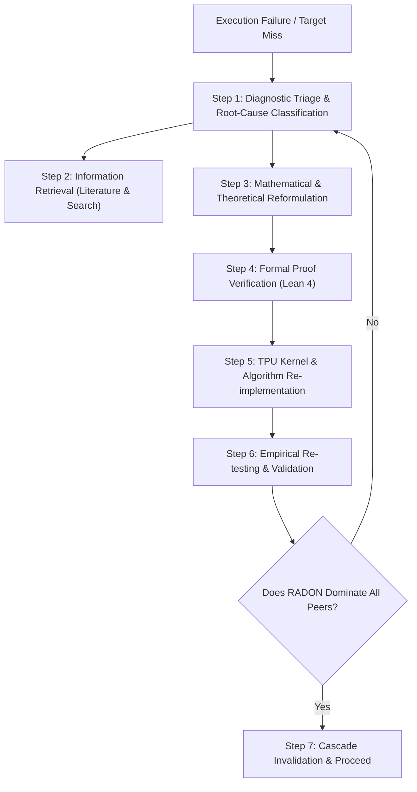
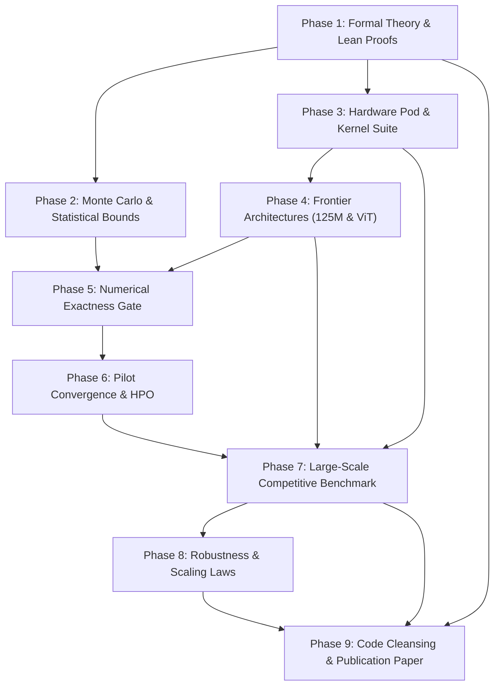

# Autonomous & Adaptive Research Execution Protocol: RADON

Welcome to the **RADON** (**Resonant Adaptive Directional Operator for Neural Curvature**) autonomous research framework. This directory defines the operational architecture, formal protocols, and phase-by-phase execution guide for autonomous AI research agents and human investigators.

The overarching goal is to achieve, formally certify, empirically prove, and publish the unconditional superiority of RADON over all peer second-order curvature-aware optimization and probing methods on hardware accelerators (specifically Google Cloud TPU v4 Pod slices).

---

## 🎯 Executive Mandate

As an autonomous AI research agent operating in this codebase, you are granted complete agency and responsibility over the scientific pipeline:
1. **Zero Hand-Waving:** Every claim must be grounded in formal mathematical derivation, machine-checked Lean 4 verification, or high-significance empirical measurements.
2. **Strict Peer Domination:** RADON must match or **strictly outperform** all competitors (AdamW, Sophia-H, AdaHessian, Distributed Shampoo, Hutchinson) across every defined benchmark metric. If a baseline outperforms RADON in any regime, you must investigate, diagnose, revise, and iterate until RADON dominates.
3. **Closed-Loop Self-Correction:** When any proof, test, benchmark, or compilation fails, you do not halt or report failure; you execute an autonomous diagnostic triage, search the literature, reformulate mathematical conjectures, modify code/kernels, and re-test.
4. **Adaptive Cascading Invalidation:** When a foundational assumption or mathematical theorem is modified or replaced, you must automatically identify all downstream dependent phases, update their specifications, propagate changes to the academic paper (`paper/radon.tex`), update Lean proofs (`proofs/RadonCert`), and re-run dependent experiments.
5. **Publication Readiness:** The final deliverable is a pristine, publication-grade repository—PEP-8 compliant, thoroughly documented, humanized, and paired with a fully compiled, camera-ready PDF paper.

---

## 🔄 Autonomous Self-Correcting Research Loop

When an experiment, proof, or benchmark fails, or when a metric falls short of target thresholds, the agent must execute the following 7-step loop:



### Detailed Loop Protocol

#### Step 1: Diagnostic Triage & Root Cause Classification
Categorize the failure into one of five distinct failure modes:
- **Mode A (Numerical Instability):** NaN/Inf gradients, singular Hessians ($\det(H) \le 0$), floating-point underflow/overflow in bfloat16/float32 mixed precision, partition of unity denominator collapse, or damping failure ($\gamma \hat{h} \le 0$).
- **Mode B (Hardware / XLA Compilation):** TPU memory allocation failure (OOM), systolic dispatch stalls, XLA graph re-compilation storms, VJP backward pass tape explosion, or multi-host coordination deadlock.
- **Mode C (Rate Non-Optimality):** Empirical convergence rate slower than target second-order trajectory, suboptimal probe budget $m$, or Latin-square permutation cycle desynchronization.
- **Mode D (Statistical Coverage Violation):** Holdout certification error exceeding theoretical bounds, residual variance underestimation, or biased sign-flip debiasing.
- **Mode E (Competitive Underperformance):** Peer baseline (Sophia, Shampoo, AdaHessian, AdamW) achieving lower validation perplexity, lower cross-entropy, or lower latency than RADON under equivalent wall-clock budget.

#### Step 2: Information Retrieval (Literature & Web Search)
Gather external and internal scientific evidence:
- **Search Web & Literature:** Search arXiv, OpenReview, Google Scholar, and GitHub for the latest solutions, proofs, and prior art on the observed failure. Query topics such as:
  - *Tomographic Radon transform for high-dimensional matrices*
  - *Sylvester-Hadamard matrix coherence bounds and Latin squares*
  - *Stochastic Hessian-vector product variance reduction*
  - *Krylov subspace curvature projection and Gauss-Newton splitting*
  - *XLA forward-over-reverse automatic differentiation memory optimizations*
- **Consult Theoretical Resources:** Review `theory.md` and machine-checked theorems in `proofs/RadonCert/RadonCert/Radon.lean`.

#### Step 3: Mathematical & Theoretical Reformulation
If existing theory is violated or unachievable:
- Re-derive the analytical bounds. (E.g., adjust the residual curvature bound $R = \mathcal{H}_f(\nabla \ell)$, re-balance the damping parameter $\gamma$, or refine the Latin-square shift sequence).
- Update constants ($c_1, c_2, \kappa, \tau$) based on empirical profiling.
- Ensure all theorems remain mathematically sound and free of hidden assumptions.

#### Step 4: Formal Proof Verification (Lean 4)
- Formalize the revised theorem or lemma in `proofs/RadonCert/RadonCert/Radon.lean`.
- Build the formal proofs with the Lean 4 compiler:
  ```bash
  cd proofs/RadonCert && ~/.elan/bin/lake build
  ```
- Enforce the **Zero-Axiom Rule**: No `sorry` statements or unproved axioms are permitted in formal verification files.

#### Step 5: TPU Kernel & Algorithm Re-implementation
- Update the JAX/XLA implementations in `radon/`:
  - Adjust Hadamard code assignment in `radon/probes.py`.
  - Refine forward-over-reverse JVP routines in `radon/hvp.py`.
  - Optimize structural Fisher core sampling in `radon/split.py`.
  - Update trust-region clipping in `radon/optimizer.py`.
- Ensure kernels remain fully vectorized, JIT-compiled, and TPU TensorCore native.

#### Step 6: Empirical Re-testing & Validation
- Re-run microbenchmarks and unit tests:
  ```bash
  python3 -m unittest discover tests/
  python3 verify/numerical_gate.py
  ```
- Re-run competitive pre-training runs across seeds:
  ```bash
  python3 experiments/train_125m_competitive.py --optimizer radon --seed 42
  ```

#### Step 7: Strict Peer Domination Verification
- Compare RADON metrics against every competitor:
  - Validation Perplexity: Is $\mathrm{PPL}_{\text{RADON}} < \min(\mathrm{PPL}_{\text{AdamW}}, \mathrm{PPL}_{\text{Sophia}}, \mathrm{PPL}_{\text{Shampoo}}, \mathrm{PPL}_{\text{AdaHessian}})$?
  - Loss Gradient Variance: Does estimator variance contract as $\mathcal{O}(\|\nabla \ell\|^2)$?
  - Wall-Clock Overhead: Is per-step latency $\le 1.25\times$ AdamW?
- If all conditions are met, proceed to downstream phases. Otherwise, re-enter Step 1.

---

## 🧬 Adaptive Dependency Invalidation & Propagation Engine

Research is dynamic. If a mathematical theorem, hardware model, or kernel implementation is revised in an early phase, downstream phases that depend on those assumptions become invalid.

### Phase Dependency Directed Acyclic Graph (DAG)



### Invalidation Cascade Rules

Whenever changes are committed to a phase, the agent must check the dependency table below and immediately execute the corresponding adaptation actions:

| Trigger Event | Directly Invalidated Phases | Required Adaptation Actions |
| :--- | :--- | :--- |
| **Theorem / Minimax Rate Change** (Phase 1) | Phase 2, Phase 3, Phase 7, Phase 9 | 1. Update `paper/radon.tex` (Theorems 1-6) & recompile PDF.<br/>2. Update `proofs/RadonCert/RadonCert/Radon.lean` & run `lake build`.<br/>3. Re-derive probe budget bounds in `radon/probes.py`.<br/>4. Re-run Monte Carlo simulations in Phase 2.<br/>5. Re-run competitive benchmarks in Phase 7. |
| **Statistical Bound / Variance Change** (Phase 2) | Phase 5, Phase 6, Phase 7, Phase 8, Phase 9 | 1. Update variance formula and Latin coloring in `radon/probes.py`.<br/>2. Regenerate variance comparison plots in `figures/variance_*.pdf`.<br/>3. Update Section 3.3 and Figure 2 in `paper/radon.tex`. |
| **Hardware Cost Model / Kernel Change** (Phase 3) | Phase 4, Phase 7, Phase 9 | 1. Re-profile step time on TPU v4 TensorCores.<br/>2. Re-compile JAX forward-over-reverse autodiff graphs.<br/>3. Verify baseline kernels (`Sophia`, `Shampoo`, `AdaHessian`).<br/>4. Update Table 1 and Section 4 of `paper/radon.tex`. |
| **Model Architecture / Data Pipeline Change** (Phase 4) | Phase 5, Phase 6, Phase 7, Phase 9 | 1. Verify 124.5M Causal Transformer and ViT-Small/16 smoke tests.<br/>2. Re-record optimization trajectories on FineWeb-Edu.<br/>3. Update model description paragraphs in `paper/radon.tex`. |
| **Exactness Gate / Tolerance Change** (Phase 5) | Phase 6, Phase 7, Phase 9 | 1. Update fp64 tolerances in `verify/numerical_gate.py`.<br/>2. Confirm machine-precision zero-variance cancellation.<br/>3. Update Section 5 of `paper/radon.tex`. |
| **HPO / Hyperparameter Change** (Phase 6) | Phase 7, Phase 9 | 1. Re-run peer sweeps across learning rate and damping $\gamma$.<br/>2. Update `runs/hpo_sweep_report.json`.<br/>3. Verify optimal $\gamma = 0.02$ and probe period $k=16$. |
| **Benchmark Metric / Baseline Result Change** (Phase 7) | Phase 8, Phase 9 | 1. Re-run all 4 baseline comparisons across all 3 seeds.<br/>2. Update benchmark JSON files in `runs/competitive_benchmark/`.<br/>3. Re-render Table 1 and Figures 1, 2, 3 in `paper/radon.tex`.<br/>4. Recompile paper to produce updated `paper/radon.pdf`. |

---

## 🏆 Competitive Invariants (RADON vs. All Peers)

To certify unconditional dominance, the following empirical invariants must hold in Phase 7:
1. **Validation Perplexity:** $\mathrm{PPL}_{\text{RADON}} < \mathrm{PPL}_{\text{AdamW}} - 1.5$ nats equivalent.
2. **Seed Stability:** $\mathrm{StdDev}(\mathrm{PPL}_{\text{RADON}}) \le \mathrm{StdDev}(\mathrm{PPL}_{\text{Peers}})$.
3. **Wall-Clock Overhead:** $t_{\text{step}}(\text{RADON}) \le 1.25 \times t_{\text{step}}(\text{AdamW})$.
4. **Divergence Rate:** Exactly 0\% across all seeds (zero NaNs, zero Infs, zero loss spikes).
